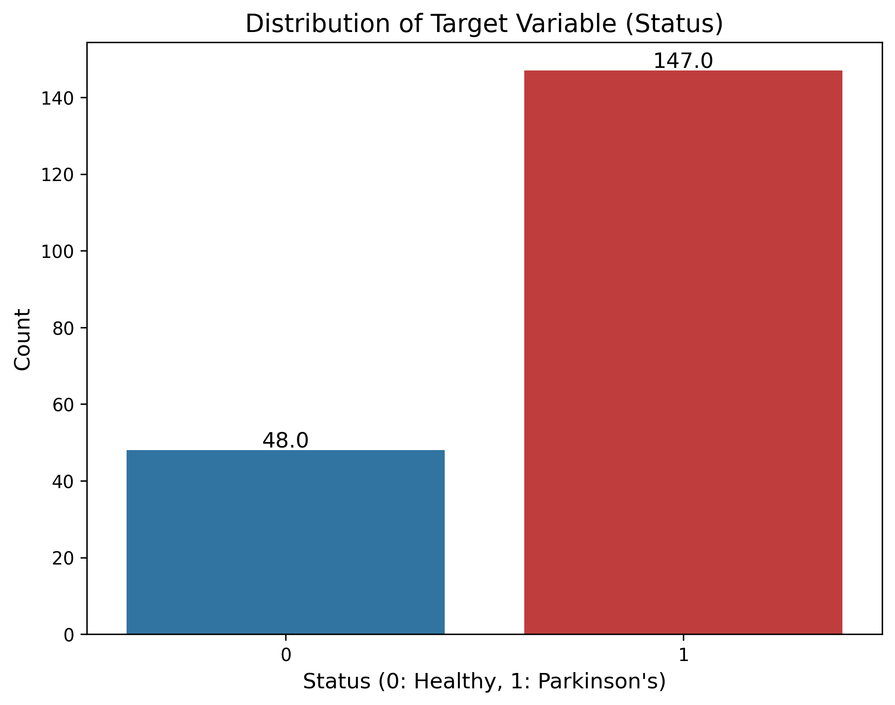
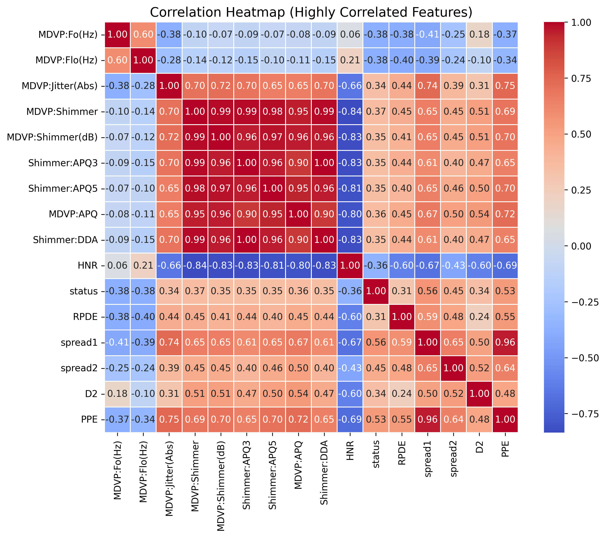
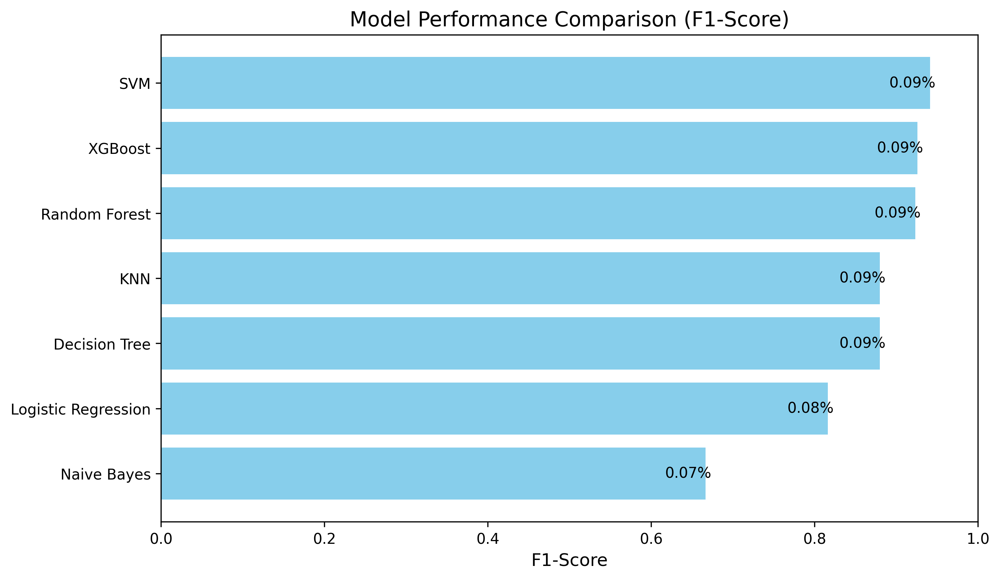

# Parkinson's Disease Detection System 🧠🎙️

Welcome to the **Parkinson's Disease Detection Machine Learning Project**. This tool leverages voice biomarkers—such as fundamental vocal frequencies, jitter, shimmer, and harmonic noise—to accurately predict the presence of Parkinson's Disease using state-of-the-art machine learning algorithms.

---

## 🚀 Quick Start & Guides

If you're eager to get the project running or want a deeper understanding of the code, please refer to the dedicated guide files in this repository:

1.  **[Setup & Execution Guide (`SETUP_AND_RUN.md`)](./SETUP_AND_RUN.md)**
    *   *Read this first.*
    *   Detailed, step-by-step instructions on Python installation, downloading module dependencies (`pip install -r requirements.txt`), and executing the data pipeline perfectly.

2.  **[Technical Explanation (`HOW_IT_WORKS.md`)](./HOW_IT_WORKS.md)**
    *   *Read this to understand the logic and math.*
    *   A deep-dive into the machine learning engineering used here: explaining data leakage prevention (Train/Test splitting), **SMOTE** balancing, hyperparameter fine-tuning via **GridSearchCV**, and Min-Max Feature Scaling.

---

## 📁 Repository Structure

*   `main.py`: The core machine learning engine. Running this script downloads the remote dataset, cleans it, processes the mathematical transformations securely without data leakage, trains **7 different ML models in parallel** utilizing all CPU cores, and ultimately exports the metric results into a `.csv` scoreboard.
*   `create_ppt.py`: An automated Python script that reads the dynamic metrics generated by `main.py` and effortlessly produces a highly formatted PowerPoint (`.pptx`) presentation summarizing your findings.
*   `requirements.txt`: The definitive set of Python libraries needed to run the project. Keep everything up to date by running `pip install -r requirements.txt`.
*   `Parkinsons_Project_Presentation.pptx`: The automatically produced presentation output summarizing the models.
*   `model_metrics_comparison.csv`: The spreadsheet output created by `main.py`, logging the performance of your Machine Learning tests.
*   `data.csv`: A local copy of the **UCI Parkinson's dataset**, automatically queried by the Python scripts when missing.
*   `/ML_Models/`: The directory where the permanently saved/trained models (pickled `.pkl` records) of Random Forests, SVMs, and XGBoost are automatically dumped.

---

## 📊 Evaluation Overview

Our completely balanced pipeline evaluates both strict, standard baselines and powerful ensemble techniques.

Rigorous testing guarantees the data is un-leaked before modeling. As shown in the generated `model_metrics_comparison.csv`, our most accurate combinations currently yield:
*   **Support Vector Machines (SVM):** ~92-94% Accuracy & F1-Score.
*   **XGBoost:** ~89-92% Accuracy & F1-Score.
*   **Random Forests:** ~89-92% Accuracy.

This establishes a very strong non-invasive metric for assessing early progression. Enjoy the project!

---

## 📉 Data Visualizations

Here are exploratory data analysis and model performance visualizations for the Parkinson's Disease dataset:

### Target Variable Distribution
Shows the balance of the target class (Healthy vs. Parkinson's detected).

### Correlation Heatmap
Displays the correlation between the most significant vocal biomarker features.

### Model Performance
Compares the F1-Score of various algorithms (Random Forest, SVM, XGBoost, etc.) tested on this data.

